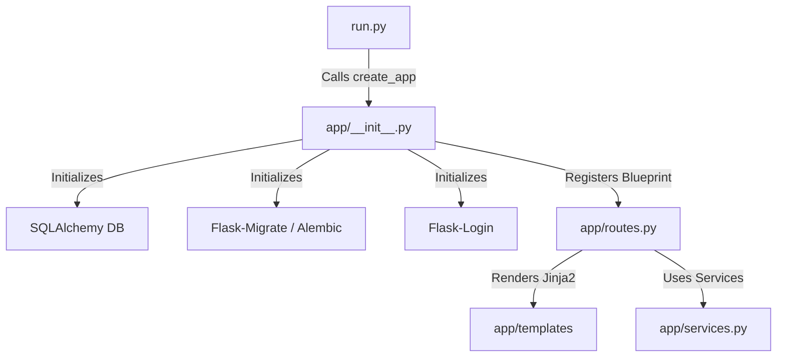
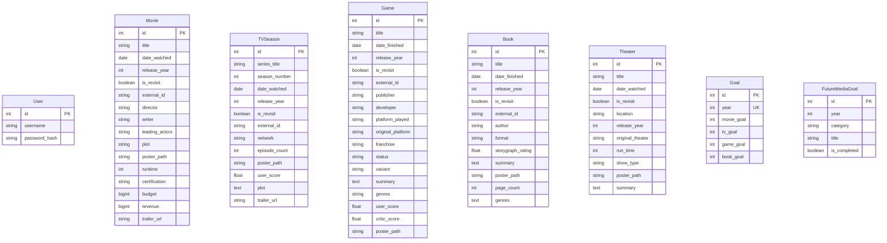

# How LeisureLedger Works: A Technical Architecture Guide

This document provides a detailed breakdown of the architecture, data structures, metadata integrations, and core workflows of **LeisureLedger** (formerly `media-tracker`).

---

## 1. Application Core & Architecture

LeisureLedger is built using the **Flask (Python 3.12.3)** web framework, following the **Application Factory Pattern** for modularity and scalability.



### Components:
* **`run.py`**: The application entry point. It instantiates the Flask app and launches the web server.
* **`app/__init__.py`**: Initializer containing the `create_app()` factory. It configures the database (`db`), migrations (`migrate`), login manager (`login`), context processors (injecting global helpers like `target_map` and models directly into Jinja2 templates), and ensures local poster directories exist.
* **`app/routes.py`**: The controller containing blueprints, routing logic, form-processing, authentication views, and dashboard aggregations.
* **`app/services.py`**: Third-party API wrappers (TMDB, IGDB, Google Books, OpenLibrary, Wikipedia, Wikidata, and IBDB) encapsulating all searching, scraping, and detail retrieval logic.
* **`app/models.py`**: PostgreSQL database schemas mapping media types, users, and tracking goals.

---

## 2. Database Models & Schema Design

LeisureLedger uses **PostgreSQL** (managed via **SQLAlchemy**). The models split media types into individual tables to accommodate specialized fields, while sharing metadata attributes like titles and release years.



---

## 3. Metadata Extraction & Search Pipelines

When a user searches for a title to track, the application queries specialized services and processes the results.

### A. Cinema & Television (TMDB)
* **API Used**: The Movie Database (TMDB) v3 API.
* **Search**: `TMDBService.search_movies()` and `search_tv()` execute token-authenticated requests.
* **Details**: `TMDBService.get_movie_details()` retrieves US MPAA ratings (`release_dates`), budget/revenue statistics, and directors/writers/actors (`credits`). `get_tv_details()` makes two calls (series-level details for network/overview and season-level details for episodes).

### B. Video Games (IGDB)
* **API Used**: Twitch IGDB API.
* **Authentication**: Twitch client credentials flow (OAuth2 token cache is managed via `IGDBService._get_token()`).
* **Protocol**: Sends `POST` requests containing specific queries using the API's custom Query Language (e.g., `fields name, summary, cover.url; where id = <id>;`).

### C. Literature (Google Books & OpenLibrary)
* **API Used**: Google Books API as primary; OpenLibrary API as fallback.
* **Resilience**: If Google Books returns a `429 Rate Limit` or quota error, the app gracefully falls back to OpenLibrary to complete the search.
* **Sanitization**: Standardizes multi-author lists (joins arrays) and handles missing ratings.

### D. Theater & Stage (IBDB + Wikipedia/Wikidata)
Because stage theater has no unified open API, a multi-source pipeline was engineered:
1. **Search**: Scrapes the **Internet Broadway Database (IBDB)** quick-search page to extract show titles, types (Play/Musical), and production slugs.
2. **Details**: Queries the **Wikipedia Open API** based on the show name to fetch the introductory extract (the plot summary).
3. **Wikidata Runtime Queries**: Locates the page's `wikibase_item` ID (Wikidata ID) and queries Wikidata claim **P2047** (Duration) to parse the show's exact Broadway runtime.
4. **Artwork**: Runs a custom Wikipedia image search for files matching "poster", "logo", or "musical" associated with the show's page, falling back to a manual poster upload if none are found.

---

## 4. Poster Asset Caching Pipeline

To maintain visual integrity and avoid dead image links (or mixed-content hotlinking issues), LeisureLedger caches all image assets locally:

1. **Extraction**: When adding a title, the service grabs the remote image URL (e.g., TMDB path `/co1r8v.jpg` or Wikipedia file upload).
2. **Streaming**: The app initiates a buffered HTTP stream (`requests.get(url, stream=True)`) to save the file.
3. **Storage**: The asset is saved to a persistent subdirectory: `/app/app/static/posters/`. On production (Railway), this folder mounts a persistent disk volume (`media-tracker-volume`) so files persist between redeployments.
4. **Deduplication**: Files are named using their external ID (e.g., `book_<volume_id>.jpg` or TMDB hash) and checked with `os.path.exists()` to prevent redundant downloads.

---

## 5. Statistics, Dashboard, & Goals Engine

The core value of the ledger lies in its annual summary metrics and rewards engine.

```
Dashboard Stats for Year (e.g. 2026)
├── Goal Progression (Goal vs. Completed)
│   ├── New Media Progress Bar (Excludes revisits)
│   └── All Media Progress Bar (Includes revisits, styled in red)
├── Star Rewards (⭐)
│   └── Counts Completed Target Titles (Up to 3 stars per category)
└── Historical Insights Navigation
    └── Compares current metrics against historical averages/maximums
```

### Calculations:
* **Historical Averages & Maxima**:
  Queries past years (e.g., `year < view_year`) to calculate the average and highest quantity of media consumed in previous years, providing benchmark feedback (e.g. *"Your historical average is 15 movies"*).
* **Dual-Progress Bars**:
  * **New Media**: Filters ledger items where `is_revisit == False` and `year == current_year`.
  * **All Media**: Counts total entries for the calendar year regardless of revisit status (displayed in red).
* **Target Validation Backend**:
  Clicking "Validate Targets" triggers a bulk background query. For every target title in the `FutureMediaGoal` table, the app queries the respective media tables using case-insensitive SQL matching (`ILIKE`) to verify if the user tracked that title during that calendar year. If a match is found, `FutureMediaGoal.is_completed` is set to `True`.

---

## 6. Operations & Deployment

* **Authentication**: Two user roles are supported via Flask-Login. Read-only visitors can view tables and progress statistics; only authenticated Admins can make modifications.
* **Database migrations**: Alembic (via Flask-Migrate) manages database schema changes.
* **Production Bootstrapping**: The app uses a Gunicorn configuration declared in a `Procfile`. On startup, Gunicorn executes `flask db upgrade` first, ensuring that all migrations are applied to the live PostgreSQL instance before launching the web server.
